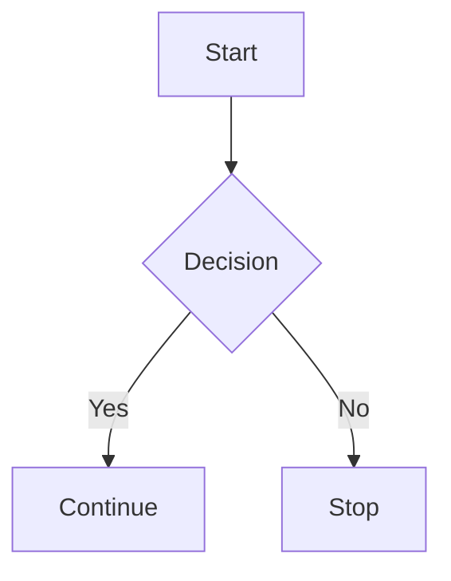

# Markdown Feature Demo

> A complete demonstration of common Markdown syntax.

---

## Table of Contents

1. Headings
2. Text Formatting
3. Lists
4. Task Lists
5. Links & Images
6. Code
7. Tables
8. Blockquotes
9. Horizontal Rules
10. Footnotes
11. Definition Lists (Limited Support)
12. Emoji
13. Escaping Characters
14. HTML
15. Collapsible Sections
16. Mathematical Expressions (Platform Dependent)

---

# Heading 1

## Heading 2

### Heading 3

#### Heading 4

##### Heading 5

###### Heading 6

---

## Text Formatting

Normal text

**Bold**

*Italic*

***Bold Italic***

~~Strikethrough~~

<u>Underline (HTML)</u>

`Inline code`

Subscript: H<sub>2</sub>O

Superscript: x<sup>2</sup>

==Highlighted== (Only supported by some renderers)

---

## Lists

### Unordered

- Apple
- Banana
  - Cavendish
  - Plantain
- Orange

### Ordered

1. First
2. Second
3. Third
   1. Nested
   2. Nested

### Mixed

1. Item
   - Bullet
   - Another Bullet
2. Item

---

## Task Lists

- [x] Completed task
- [x] Another completed task
- [ ] Pending task
- [ ] Future work

---

## Links

Inline link:

[OpenAI](https://openai.com)

Automatic link:

<https://github.com>

Email:

<example@example.com>

Reference-style link:

This is a [reference link][openai].

[openai]: https://openai.com

---

## Images

```md

```

Example (may not render if URL is invalid):


---

## Code

Inline:

`print("Hello")`

### Fenced Code

```python
def greet(name):
    print(f"Hello, {name}")

greet("Markdown")
```

```javascript
const square = x => x * x;
console.log(square(5));
```

```json
{
  "name": "Markdown",
  "version": 1.0,
  "features": ["tables", "lists", "code"]
}
```

```bash
git clone https://github.com/example/repo.git
cd repo
npm install
```

---

## Tables

| Feature | Supported | Notes |
|---------|:---------:|------:|
| Headings | ✅ | Standard |
| Tables | ✅ | GFM |
| HTML | ⚠️ | Renderer dependent |
| Math | ⚠️ | Platform dependent |

Alignment:

| Left | Center | Right |
|:-----|:------:|------:|
| A | B | C |
| 1 | 2 | 3 |

---

## Blockquotes

> Simple quote.

> Nested quote
>
>> Level 2
>>
>>> Level 3

---

## Horizontal Rules

---

***

___

---

## Footnotes

Markdown supports footnotes in some renderers.

Here is a sentence with a footnote.[^1]

Another footnote.[^long]

[^1]: A simple footnote.

[^long]:
    Footnotes can contain multiple paragraphs,
    code, and more.

---

## Definition Lists

Term 1

: Definition 1

Term 2

: Definition 2

---

## Emoji

:smile: :rocket: :heart: :tada:

Unicode also works:

😀 🚀 ❤️ 🎉

---

## Escaping Characters

\*Not italic\*

\# Not a heading

\`Not code\`

\\ Backslash

---

## HTML

<div style="padding:12px;border:1px solid #999;border-radius:6px;">
<strong>HTML Block</strong><br>
Markdown allows raw HTML in many renderers.
</div>

<kbd>Ctrl</kbd> + <kbd>C</kbd>

<mark>Highlighted with HTML</mark>

---

## Collapsible Section

<details>

<summary>Click to expand</summary>

This content is hidden until expanded.

- Item A
- Item B
- Item C

</details>

---

## Mathematical Expressions

Inline (if supported):

$E = mc^2$

Block:

$$
\int_0^\infty e^{-x}\,dx = 1
$$

---

## Mixed Example

> **Tip**
>
> Install dependencies:
>
> ```bash
> npm install
> ```
>
> Then run:
>
> ```bash
> npm start
> ```

---

## Keyboard Shortcuts

| Shortcut | Action |
|----------|--------|
| <kbd>Ctrl</kbd> + <kbd>S</kbd> | Save |
| <kbd>Ctrl</kbd> + <kbd>Z</kbd> | Undo |
| <kbd>Ctrl</kbd> + <kbd>C</kbd> | Copy |

---

## Nested Formatting

- **Bold**
  - *Italic*
    - `Code`
      - ~~Strike~~

1. **Bold**
   1. *Italic*
      1. `Code`

---

## Checklist Example

### Project

- [x] Requirements
- [x] Design
- [x] Development
- [ ] Testing
- [ ] Deployment

---

## Mermaid Diagram (if supported)

````md

````

---

## File Tree

```text
project/
├── README.md
├── docs/
│   ├── intro.md
│   └── api.md
├── src/
│   ├── main.py
│   └── utils.py
└── LICENSE
```

---

## Quote with Citation

> "Programs must be written for people to read."
>
> — Harold Abelson

---

## End

**Congratulations!** 🎉

You've seen most Markdown features supported by GitHub Flavored Markdown and many modern Markdown renderers.
